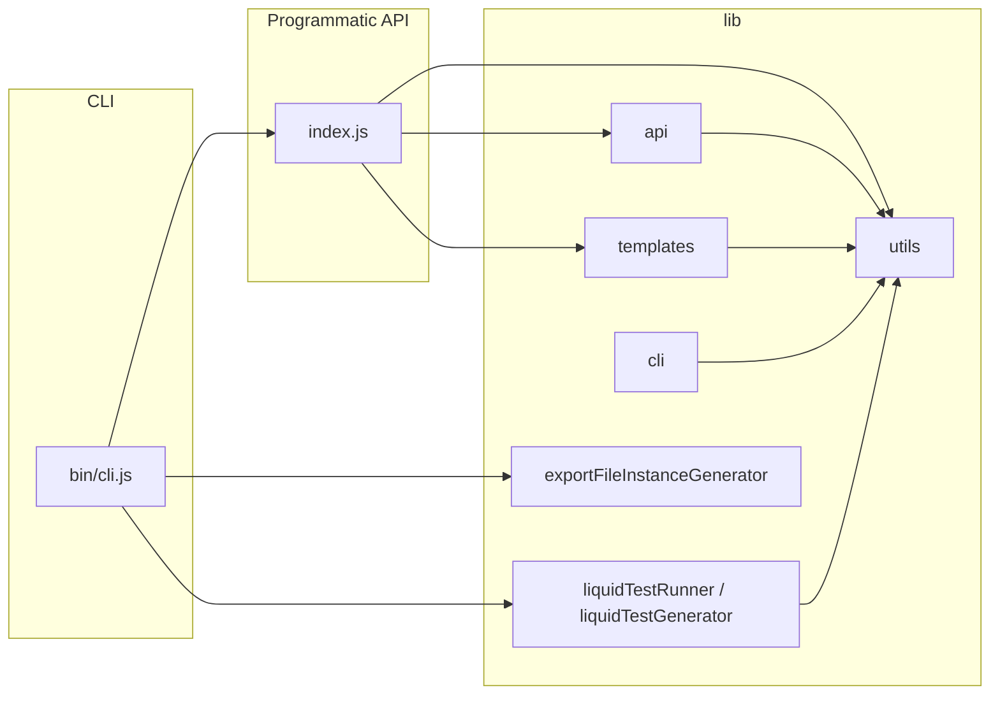

# silverfin-cli architecture

High-level map of the package. For commands to run and contributor rules, see [AGENTS.md](../AGENTS.md). For how **users** lay out a Liquid template repository on disk, see [README.md](../README.md) — that layout is **not** the same as this repo’s `lib/` tree.

## Flow overview

- **bin/cli.js** is the Commander entry: it calls **`index.js`** for template workflows and pulls in **Liquid test** and **export-instance** modules directly where the CLI needs them.
- **index.js** orchestrates template types (reconciliations, shared parts, export files, account templates) using **`lib/api`** and **`lib/templates`**, plus filesystem helpers.

## `lib/` responsibilities

### `lib/api/`

| Module | Responsibility |
|--------|------------------|
| [sfApi.js](../lib/api/sfApi.js) | Silverfin REST calls (reconciliations, shared parts, export files, account templates, etc.). Builds axios instances via `AxiosFactory`, handles responses with `apiUtils`. |
| [silverfinAuthorizer.js](../lib/api/silverfinAuthorizer.js) | OAuth-style firm authorization (browser + code), token refresh, partner token refresh. |
| [axiosFactory.js](../lib/api/axiosFactory.js) | Configured axios instances for firm/partner contexts (base URL, auth headers, optional basic auth). |
| [firmCredentials.js](../lib/api/firmCredentials.js) | Persisted tokens, host, firm name; read/write credential store used by authorizer and API layer. |

### `lib/templates/`

Object-oriented wrappers around on-disk template folders and sync with the API:

- **reconciliationText.js** — reconciliation texts under `reconciliation_texts/`
- **sharedPart.js** — `shared_parts/`
- **exportFile.js** — `export_files/`
- **accountTemplate.js** — `account_templates/`

They work with [fsUtils.js](../lib/utils/fsUtils.js) and [templateUtils.js](../lib/utils/templateUtils.js) for paths, configs, and IDs.

### `lib/cli/`

Command-line–specific behavior (not re-exported as the main programmatic API):

- **utils.js** — option checks, default firm id, uncaught error wiring to `errorUtils`
- **cwdValidator.js** — working-directory validation for repo conventions
- **autoCompletions.js** — shell completions
- **cliUpdater.js** — CLI self-update
- **stats.js**, **changelogReader.js**, **spinner.js**, **devMode.js** — UX and maintenance helpers

### `lib/utils/`

Shared cross-cutting helpers: **errorUtils** (messages, exits, batch summaries), **fsUtils**, **apiUtils** (env checks, response handlers), **urlHandler**, **wslHandler**, **runTestUtils**, **liquidTestUtils**, etc.

### Root-level `lib/*.js` (not under a subfolder)

| Module | Responsibility |
|--------|------------------|
| [liquidTestRunner.js](../lib/liquidTestRunner.js) | Run Liquid tests from the CLI against the API. |
| [liquidTestGenerator.js](../lib/liquidTestGenerator.js) | Generate test YAML from company data. |
| [exportFileInstanceGenerator.js](../lib/exportFileInstanceGenerator.js) | Export file instance generation workflow used by CLI commands. |

## Tests

Jest tests live under [tests/](../tests/) and generally mirror `lib/`. See [AGENTS.md](../AGENTS.md) for commands; API tests often use `axios-mock-adapter`.
